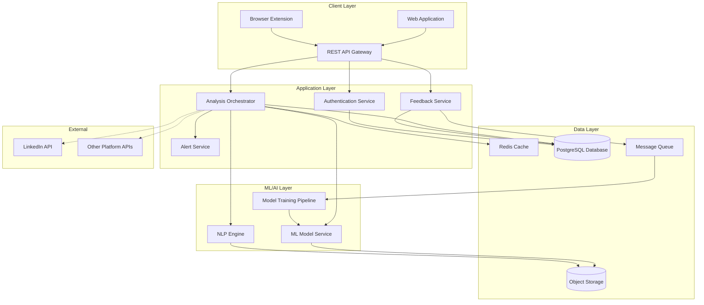

# Design Document: TrustGuard AI Credibility Analysis

## Overview

TrustGuard AI is a cloud-based credibility analysis platform that uses machine learning and natural language processing to protect users from fake profiles, spam messages, and misleading interactions on professional networking platforms. The system provides real-time analysis and classification of messages and profiles, assigns credibility scores, and delivers alerts to users before they engage with potentially harmful content.

The platform is designed with modularity and scalability in mind, allowing for future integration with multiple professional platforms while maintaining high performance and low operational costs through cloud-native architecture.

## Architecture

The system follows a microservices architecture deployed on cloud infrastructure with the following key components:



### Architecture Principles

1. **Separation of Concerns**: Each service has a single, well-defined responsibility
2. **Scalability**: Services can scale independently based on load
3. **Resilience**: Failures in one service don't cascade to others
4. **Observability**: Comprehensive logging and monitoring throughout
5. **Security**: Defense in depth with encryption, authentication, and authorization at every layer

## Components and Interfaces

### 1. REST API Gateway

**Responsibility**: Entry point for all client requests, handles authentication, rate limiting, and routing.

**Interface**:
```typescript
// Analyze a message
POST /api/v1/analyze/message
Request: {
  messageId: string,
  content: string,
  senderId: string,
  metadata: {
    platform: string,
    timestamp: string,
    conversationId?: string
  }
}
Response: {
  classification: "Safe" | "Suspicious" | "Spam",
  credibilityScore: number,
  reasons: string[],
  alert: Alert | null
}

// Analyze a profile
POST /api/v1/analyze/profile
Request: {
  profileId: string,
  platform: string,
  attributes: {
    hasPhoto: boolean,
    workHistory: WorkEntry[],
    education: EducationEntry[],
    connectionCount: number,
    activityHistory: ActivityEntry[]
  }
}
Response: {
  credibilityScore: number,
  flags: string[],
  riskLevel: "Low" | "Medium" | "High"
}

// Submit feedback
POST /api/v1/feedback
Request: {
  analysisId: string,
  correct: boolean,
  actualClassification?: "Safe" | "Suspicious" | "Spam",
  comments?: string
}
Response: {
  feedbackId: string,
  acknowledged: boolean
}

// Get user alerts
GET /api/v1/alerts?userId={userId}&limit={limit}
Response: {
  alerts: Alert[],
  total: number
}
```

### 2. Analysis Orchestrator

**Responsibility**: Coordinates the analysis workflow, combining results from NLP Engine and ML Model Service.

**Interface**:
```typescript
interface AnalysisOrchestrator {
  analyzeMessage(message: Message): Promise<MessageAnalysis>
  analyzeProfile(profile: Profile): Promise<ProfileAnalysis>
  getCachedAnalysis(id: string): Promise<Analysis | null>
  cacheAnalysis(id: string, analysis: Analysis): Promise<void>
}

interface MessageAnalysis {
  classification: Classification
  credibilityScore: number
  intent: MessageIntent
  patterns: DetectedPattern[]
  profileScore: number
  reasons: string[]
}

interface ProfileAnalysis {
  credibilityScore: number
  completenessScore: number
  consistencyScore: number
  behavioralFlags: string[]
  riskLevel: RiskLevel
}
```

**Algorithm**:
1. Check cache for existing analysis
2. If not cached, extract features from message/profile
3. Call NLP Engine for message intent analysis
4. Call ML Model Service for classification
5. Calculate credibility score using weighted formula
6. Generate reasons for classification
7. Cache results
8. Return analysis

### 3. NLP Engine

**Responsibility**: Performs natural language processing on message content to identify intent, sentiment, and linguistic patterns.

**Interface**:
```typescript
interface NLPEngine {
  analyzeIntent(text: string): Promise<IntentAnalysis>
  detectPatterns(text: string): Promise<PatternMatch[]>
  extractFeatures(text: string): Promise<TextFeatures>
}

interface IntentAnalysis {
  primaryIntent: MessageIntent
  confidence: number
  indicators: string[]
}

interface TextFeatures {
  sentimentScore: number
  urgencyLevel: number
  personalityMarkers: string[]
  linguisticFlags: string[]
  readabilityScore: number
}

enum MessageIntent {
  NETWORKING = "networking",
  JOB_OPPORTUNITY = "job_opportunity",
  SOLICITATION = "solicitation",
  PHISHING = "phishing",
  SPAM = "spam",
  GENUINE_INQUIRY = "genuine_inquiry"
}
```

**Implementation Approach**:
- Use pre-trained transformer models (e.g., BERT, RoBERTa) fine-tuned on professional communication
- Implement intent classification as multi-class classification
- Use pattern matching for known phishing/spam indicators
- Extract linguistic features using spaCy or similar NLP library

### 4. ML Model Service

**Responsibility**: Provides machine learning predictions for message and profile classification.

**Interface**:
```typescript
interface MLModelService {
  predictMessageClass(features: MessageFeatures): Promise<Prediction>
  predictProfileCredibility(features: ProfileFeatures): Promise<Prediction>
  getModelVersion(): string
  getModelMetrics(): ModelMetrics
}

interface MessageFeatures {
  textFeatures: TextFeatures
  senderProfileScore: number
  behavioralFeatures: BehavioralFeatures
  contextFeatures: ContextFeatures
}

interface ProfileFeatures {
  completeness: number
  consistency: number
  connectionPatterns: ConnectionMetrics
  activityMetrics: ActivityMetrics
  accountAge: number
}

interface Prediction {
  classification: Classification
  confidence: number
  featureImportance: Record<string, number>
}
```

**Model Architecture**:
- Ensemble approach combining:
  - Gradient Boosting (XGBoost/LightGBM) for structured features
  - Neural network for text embeddings
  - Rule-based system for known patterns
- Feature engineering pipeline for profile and message attributes
- Model versioning and A/B testing support

### 5. Model Training Pipeline

**Responsibility**: Handles continuous model improvement using user feedback and new data.

**Interface**:
```typescript
interface TrainingPipeline {
  collectTrainingData(): Promise<TrainingDataset>
  trainModel(dataset: TrainingDataset): Promise<TrainedModel>
  validateModel(model: TrainedModel): Promise<ValidationMetrics>
  deployModel(model: TrainedModel): Promise<DeploymentResult>
}

interface TrainingDataset {
  features: FeatureMatrix
  labels: Label[]
  metadata: DatasetMetadata
}

interface ValidationMetrics {
  accuracy: number
  precision: number
  recall: number
  f1Score: number
  confusionMatrix: number[][]
  falsePositiveRate: number
  falseNegativeRate: number
}
```

**Training Process**:
1. Collect feedback data from queue
2. Combine with existing training data
3. Perform data validation and cleaning
4. Split into train/validation/test sets
5. Train new model version
6. Validate against test set
7. Compare metrics with current production model
8. If improvement > 2%, deploy new model
9. Monitor performance post-deployment

### 6. Alert Service

**Responsibility**: Generates and delivers real-time alerts to users based on analysis results.

**Interface**:
```typescript
interface AlertService {
  createAlert(analysis: Analysis, userId: string): Promise<Alert>
  getAlerts(userId: string, filters: AlertFilters): Promise<Alert[]>
  markAlertRead(alertId: string): Promise<void>
  getAlertStats(userId: string): Promise<AlertStats>
}

interface Alert {
  id: string
  userId: string
  type: "message" | "profile"
  severity: "low" | "medium" | "high"
  classification: Classification
  credibilityScore: number
  reasons: string[]
  timestamp: string
  read: boolean
  targetId: string
}
```

**Alert Generation Rules**:
- Generate alert if classification is "Suspicious" or "Spam"
- Generate alert if credibility score < 40
- Include top 3 reasons for classification
- Set severity based on score: <20 = high, 20-40 = medium, 40-70 = low

### 7. Feedback Service

**Responsibility**: Collects and processes user feedback on classification accuracy.

**Interface**:
```typescript
interface FeedbackService {
  submitFeedback(feedback: UserFeedback): Promise<FeedbackResult>
  getFeedbackStats(): Promise<FeedbackStats>
  exportFeedbackForTraining(): Promise<TrainingData[]>
}

interface UserFeedback {
  analysisId: string
  userId: string
  correct: boolean
  actualClassification?: Classification
  comments?: string
  timestamp: string
}

interface FeedbackStats {
  totalFeedback: number
  accuracyRate: number
  falsePositives: number
  falseNegatives: number
  byClassification: Record<Classification, ClassificationStats>
}
```

## Data Models

### Core Entities

```typescript
// Message entity
interface Message {
  id: string
  content: string
  senderId: string
  recipientId: string
  platform: string
  timestamp: Date
  conversationId?: string
  metadata: Record<string, any>
}

// Profile entity
interface Profile {
  id: string
  platform: string
  userId: string
  attributes: ProfileAttributes
  lastUpdated: Date
  credibilityScore?: number
}

interface ProfileAttributes {
  hasPhoto: boolean
  photoQuality?: "low" | "medium" | "high"
  headline?: string
  summary?: string
  workHistory: WorkEntry[]
  education: EducationEntry[]
  skills: string[]
  connectionCount: number
  endorsementCount: number
  activityHistory: ActivityEntry[]
  accountCreated: Date
  lastActive: Date
}

interface WorkEntry {
  company: string
  title: string
  startDate: Date
  endDate?: Date
  description?: string
  verified: boolean
}

interface EducationEntry {
  institution: string
  degree: string
  field: string
  startDate: Date
  endDate?: Date
  verified: boolean
}

interface ActivityEntry {
  type: "post" | "comment" | "share" | "connection"
  timestamp: Date
  engagement: number
}

// Analysis entity
interface Analysis {
  id: string
  type: "message" | "profile"
  targetId: string
  userId: string
  classification: Classification
  credibilityScore: number
  reasons: string[]
  features: Record<string, any>
  modelVersion: string
  timestamp: Date
  feedbackReceived: boolean
}

type Classification = "Safe" | "Suspicious" | "Spam"

// Behavioral patterns
interface BehavioralFeatures {
  messagingFrequency: number
  connectionRate: number
  responseTime: number
  massMessagingIndicator: boolean
  coordinatedBehavior: boolean
}

// User entity
interface User {
  id: string
  email: string
  name: string
  platforms: PlatformConnection[]
  preferences: UserPreferences
  createdAt: Date
}

interface PlatformConnection {
  platform: string
  platformUserId: string
  connected: boolean
  permissions: string[]
}

interface UserPreferences {
  alertThreshold: number
  notificationChannels: string[]
  autoBlock: boolean
}
```

### Database Schema

**PostgreSQL Tables**:

```sql
-- Users table
CREATE TABLE users (
  id UUID PRIMARY KEY,
  email VARCHAR(255) UNIQUE NOT NULL,
  name VARCHAR(255) NOT NULL,
  created_at TIMESTAMP NOT NULL,
  updated_at TIMESTAMP NOT NULL
);

-- Platform connections
CREATE TABLE platform_connections (
  id UUID PRIMARY KEY,
  user_id UUID REFERENCES users(id),
  platform VARCHAR(50) NOT NULL,
  platform_user_id VARCHAR(255) NOT NULL,
  connected BOOLEAN DEFAULT true,
  permissions JSONB,
  created_at TIMESTAMP NOT NULL
);

-- Analyses
CREATE TABLE analyses (
  id UUID PRIMARY KEY,
  type VARCHAR(20) NOT NULL,
  target_id VARCHAR(255) NOT NULL,
  user_id UUID REFERENCES users(id),
  classification VARCHAR(20) NOT NULL,
  credibility_score INTEGER NOT NULL,
  reasons JSONB NOT NULL,
  features JSONB NOT NULL,
  model_version VARCHAR(50) NOT NULL,
  timestamp TIMESTAMP NOT NULL,
  feedback_received BOOLEAN DEFAULT false
);

CREATE INDEX idx_analyses_user_id ON analyses(user_id);
CREATE INDEX idx_analyses_timestamp ON analyses(timestamp);
CREATE INDEX idx_analyses_classification ON analyses(classification);

-- Alerts
CREATE TABLE alerts (
  id UUID PRIMARY KEY,
  user_id UUID REFERENCES users(id),
  analysis_id UUID REFERENCES analyses(id),
  type VARCHAR(20) NOT NULL,
  severity VARCHAR(20) NOT NULL,
  read BOOLEAN DEFAULT false,
  created_at TIMESTAMP NOT NULL
);

CREATE INDEX idx_alerts_user_id ON alerts(user_id);
CREATE INDEX idx_alerts_read ON alerts(read);

-- Feedback
CREATE TABLE feedback (
  id UUID PRIMARY KEY,
  analysis_id UUID REFERENCES analyses(id),
  user_id UUID REFERENCES users(id),
  correct BOOLEAN NOT NULL,
  actual_classification VARCHAR(20),
  comments TEXT,
  created_at TIMESTAMP NOT NULL
);

CREATE INDEX idx_feedback_analysis_id ON feedback(analysis_id);
CREATE INDEX idx_feedback_created_at ON feedback(created_at);

-- Model metrics
CREATE TABLE model_metrics (
  id UUID PRIMARY KEY,
  model_version VARCHAR(50) NOT NULL,
  accuracy DECIMAL(5,4) NOT NULL,
  precision DECIMAL(5,4) NOT NULL,
  recall DECIMAL(5,4) NOT NULL,
  f1_score DECIMAL(5,4) NOT NULL,
  false_positive_rate DECIMAL(5,4) NOT NULL,
  false_negative_rate DECIMAL(5,4) NOT NULL,
  deployed_at TIMESTAMP NOT NULL
);
```

### Caching Strategy

**Redis Cache Structure**:
- Key: `analysis:{type}:{targetId}`
- TTL: 24 hours for message analysis, 7 days for profile analysis
- Value: Serialized Analysis object

**Cache Invalidation**:
- Invalidate profile cache when new activity detected
- Invalidate message cache when feedback received
- Implement cache warming for frequently accessed profiles


## Correctness Properties

*A property is a characteristic or behavior that should hold true across all valid executions of a system—essentially, a formal statement about what the system should do. Properties serve as the bridge between human-readable specifications and machine-verifiable correctness guarantees.*

### Message Analysis Properties

**Property 1: Message extraction completeness**
*For any* message received by the system, extracting content and metadata should produce a structured object containing all expected fields (content, senderId, platform, timestamp).
**Validates: Requirements 1.1**

**Property 2: Intent classification coverage**
*For any* message analyzed by the NLP Engine, the system should assign exactly one message intent from the defined set of intents.
**Validates: Requirements 1.2**

**Property 3: Classification completeness**
*For any* message analyzed, the system should assign exactly one classification from {Safe, Suspicious, Spam}.
**Validates: Requirements 1.3**

**Property 4: Phishing detection**
*For any* message containing known phishing indicators (e.g., urgent requests for credentials, suspicious links, impersonation patterns), the system should classify it as Spam.
**Validates: Requirements 1.4**

**Property 5: Solicitation classification**
*For any* message showing solicitation patterns, the system should classify it as either Suspicious or Spam, never as Safe.
**Validates: Requirements 1.5**

### Profile Analysis Properties

**Property 6: Profile completeness evaluation**
*For any* profile analyzed, the system should produce completeness scores for all required components (photo, work history, education, connections).
**Validates: Requirements 2.1**

**Property 7: Consistency checking**
*For any* profile with inconsistent attributes (e.g., overlapping work dates, mismatched locations, impossible timelines), the system should detect and flag the inconsistencies.
**Validates: Requirements 2.2**

**Property 8: Inconsistency penalty**
*For any* profile, adding inconsistent information should result in a lower credibility score than the same profile without inconsistencies.
**Validates: Requirements 2.3**

**Property 9: Suspicious connection pattern detection**
*For any* profile with suspicious connection patterns (e.g., rapid connection growth, low engagement ratio, bot-like behavior), the system should flag it as potentially fake.
**Validates: Requirements 2.4**

**Property 10: Minimal activity classification**
*For any* profile with activity history below the minimum threshold, the system should classify it as Suspicious.
**Validates: Requirements 2.6**

### Scoring Properties

**Property 11: Score range invariant**
*For any* message or profile analyzed, the assigned credibility score should be between 0 and 100 inclusive.
**Validates: Requirements 1.6, 2.5**

**Property 12: Score-to-classification mapping**
*For any* credibility score, the classification should follow the mapping: score > 70 → Safe, 40 ≤ score ≤ 70 → Suspicious, score < 40 → Spam.
**Validates: Requirements 6.3, 6.4, 6.5**

**Property 13: Message score factors**
*For any* message, changing any of the scoring factors (message intent, content quality, sender profile credibility) should affect the final credibility score.
**Validates: Requirements 6.1**

**Property 14: Profile score factors**
*For any* profile, changing any of the scoring factors (completeness, consistency, connection patterns, activity history) should affect the final credibility score.
**Validates: Requirements 6.2**

**Property 15: Score recalculation**
*For any* cached analysis, when new information becomes available (e.g., updated profile data, new activity), the system should recalculate the credibility score and the new score may differ from the cached value.
**Validates: Requirements 6.6**

### Alert System Properties

**Property 16: Alert generation for risky classifications**
*For any* message or profile classified as Suspicious or Spam, the system should generate an alert.
**Validates: Requirements 3.1**

**Property 17: Alert generation for low scores**
*For any* profile with a credibility score below 40, the system should generate an alert.
**Validates: Requirements 3.4**

**Property 18: Alert structure completeness**
*For any* alert generated, it should include the classification and credibility score.
**Validates: Requirements 3.2**

**Property 19: Alert reasoning**
*For any* alert generated, it should include at least one specific reason for the classification.
**Validates: Requirements 3.3**

### Behavioral Pattern Properties

**Property 20: Known scam pattern detection**
*For any* message or profile matching known scam operation patterns, the system should classify it as Spam.
**Validates: Requirements 5.5, 5.1**

**Property 21: Coordinated spam detection**
*For any* set of similar messages from different profiles within a time window, the system should identify them as coordinated spam behavior.
**Validates: Requirements 5.2**

**Property 22: Mass-messaging classification**
*For any* profile showing mass-messaging behavior (high message volume, low personalization), the system should classify it as Spam.
**Validates: Requirements 5.3**

**Property 23: Connection farming detection**
*For any* profile that rapidly creates connections without meaningful engagement, the system should flag it as Suspicious.
**Validates: Requirements 5.4**

### Feedback and Learning Properties

**Property 24: Feedback storage round-trip**
*For any* feedback submitted on an analysis, storing and then retrieving the feedback should return the same feedback data linked to the correct analysis.
**Validates: Requirements 4.1**

### Security and Privacy Properties

**Property 25: Data encryption**
*For any* user data stored in the database, it should be encrypted using industry-standard encryption algorithms.
**Validates: Requirements 8.1**

### API Properties

**Property 26: Authentication enforcement**
*For any* API request without valid authentication credentials, the system should reject the request with an authentication error.
**Validates: Requirements 9.2**

**Property 27: Malformed request handling**
*For any* malformed API request, the system should return a descriptive error message indicating what is wrong with the request.
**Validates: Requirements 9.3**

**Property 28: JSON response format**
*For any* successful API request, the response should be valid JSON that can be parsed without errors.
**Validates: Requirements 9.4**

### Monitoring Properties

**Property 29: Prediction logging**
*For any* prediction made by the ML model, the system should log the prediction along with its confidence score.
**Validates: Requirements 10.1**

**Property 30: Feedback metrics calculation**
*For any* feedback received, the system should update accuracy metrics by comparing the prediction to the actual outcome.
**Validates: Requirements 10.2**

**Property 31: Error rate tracking**
*For any* set of predictions with feedback, the system should track false positive and false negative rates as separate metrics.
**Validates: Requirements 10.4**

## Error Handling

### Error Categories

1. **Input Validation Errors**
   - Missing required fields
   - Invalid data types
   - Out-of-range values
   - Malformed JSON

2. **Authentication/Authorization Errors**
   - Missing API key
   - Invalid API key
   - Expired token
   - Insufficient permissions

3. **Rate Limiting Errors**
   - Too many requests
   - Quota exceeded

4. **External Service Errors**
   - Platform API unavailable
   - Network timeout
   - Service degradation

5. **Model Errors**
   - Model unavailable
   - Prediction failure
   - Feature extraction failure

6. **Data Errors**
   - Database connection failure
   - Cache unavailable
   - Data corruption

### Error Handling Strategy

**Graceful Degradation**:
- If NLP Engine fails, fall back to rule-based classification
- If ML Model fails, use previous cached result if available
- If cache fails, proceed with direct database queries
- If external platform API fails, analyze with available data only

**Error Response Format**:
```typescript
interface ErrorResponse {
  error: {
    code: string
    message: string
    details?: Record<string, any>
    retryAfter?: number
  }
  requestId: string
  timestamp: string
}
```

**Retry Logic**:
- Exponential backoff for transient failures
- Maximum 3 retries for external API calls
- Circuit breaker pattern for failing services
- Dead letter queue for failed async operations

**Logging and Monitoring**:
- Log all errors with context and stack traces
- Alert on error rate thresholds
- Track error patterns for debugging
- Maintain error metrics dashboard

## Testing Strategy

### Dual Testing Approach

The testing strategy employs both unit testing and property-based testing as complementary approaches:

- **Unit tests** verify specific examples, edge cases, and error conditions
- **Property tests** verify universal properties across all inputs through randomization
- Together they provide comprehensive coverage: unit tests catch concrete bugs, property tests verify general correctness

### Property-Based Testing

**Framework**: We will use **fast-check** for TypeScript/JavaScript components and **Hypothesis** for Python components (if any ML pipeline code is in Python).

**Configuration**:
- Each property test must run a minimum of 100 iterations
- Each test must reference its design document property using the tag format:
  - `// Feature: trustguard-ai-credibility-analysis, Property N: [property text]`
- Each correctness property must be implemented by a single property-based test

**Property Test Examples**:

```typescript
// Feature: trustguard-ai-credibility-analysis, Property 11: Score range invariant
test('credibility scores are always between 0 and 100', () => {
  fc.assert(
    fc.property(
      fc.record({
        content: fc.string(),
        senderId: fc.uuid(),
        platform: fc.constantFrom('linkedin', 'indeed', 'glassdoor')
      }),
      async (message) => {
        const analysis = await analyzeMessage(message);
        expect(analysis.credibilityScore).toBeGreaterThanOrEqual(0);
        expect(analysis.credibilityScore).toBeLessThanOrEqual(100);
      }
    ),
    { numRuns: 100 }
  );
});

// Feature: trustguard-ai-credibility-analysis, Property 12: Score-to-classification mapping
test('classification matches score thresholds', () => {
  fc.assert(
    fc.property(
      fc.integer({ min: 0, max: 100 }),
      (score) => {
        const classification = scoreToClassification(score);
        if (score > 70) {
          expect(classification).toBe('Safe');
        } else if (score >= 40) {
          expect(classification).toBe('Suspicious');
        } else {
          expect(classification).toBe('Spam');
        }
      }
    ),
    { numRuns: 100 }
  );
});
```

### Unit Testing

**Focus Areas**:
- Specific examples demonstrating correct behavior
- Edge cases (empty messages, minimal profiles, boundary values)
- Error conditions (invalid input, service failures, timeouts)
- Integration points between components

**Unit Test Balance**:
- Avoid writing too many unit tests for cases covered by property tests
- Focus unit tests on concrete scenarios that illustrate requirements
- Use unit tests for integration testing between components
- Property tests handle comprehensive input coverage

**Example Unit Tests**:

```typescript
describe('Message Analysis', () => {
  test('empty message content is handled gracefully', async () => {
    const message = { content: '', senderId: 'user123', platform: 'linkedin' };
    const analysis = await analyzeMessage(message);
    expect(analysis.classification).toBe('Spam');
    expect(analysis.reasons).toContain('Empty message content');
  });

  test('phishing message with credential request is classified as Spam', async () => {
    const message = {
      content: 'Urgent: Verify your account credentials at http://fake-site.com',
      senderId: 'user456',
      platform: 'linkedin'
    };
    const analysis = await analyzeMessage(message);
    expect(analysis.classification).toBe('Spam');
    expect(analysis.reasons).toContain('Phishing indicators detected');
  });
});

describe('Alert Service', () => {
  test('alert is generated for Spam classification', async () => {
    const analysis = {
      classification: 'Spam',
      credibilityScore: 15,
      reasons: ['Known spam pattern']
    };
    const alert = await alertService.createAlert(analysis, 'user789');
    expect(alert).toBeDefined();
    expect(alert.severity).toBe('high');
  });
});
```

### Integration Testing

**Scope**:
- End-to-end API workflows
- Database interactions
- Cache behavior
- External API integrations (with mocks)
- Model inference pipeline

**Test Environment**:
- Use Docker containers for isolated test databases
- Mock external platform APIs
- Use test ML models with known behavior
- Separate test and production environments

### Performance Testing

**Load Testing**:
- Simulate 10,000 concurrent users
- Measure response times under load
- Verify auto-scaling behavior
- Test rate limiting

**Benchmarks**:
- 95th percentile response time < 2 seconds
- 99th percentile response time < 5 seconds
- Throughput: 1000 requests/second minimum
- Model inference time < 500ms

### Model Testing

**Validation**:
- Accuracy > 85% on test set
- False positive rate < 10%
- False negative rate < 15%
- Consistent performance across user segments

**A/B Testing**:
- Deploy new models to 10% of traffic initially
- Monitor metrics for 48 hours
- Gradual rollout if metrics improve
- Automatic rollback if metrics degrade

### Continuous Integration

**CI Pipeline**:
1. Run linting and code formatting checks
2. Run unit tests (must pass 100%)
3. Run property-based tests (must pass 100%)
4. Run integration tests
5. Build Docker images
6. Deploy to staging environment
7. Run smoke tests
8. Manual approval for production deployment

**Test Coverage Goals**:
- Line coverage > 80%
- Branch coverage > 75%
- Critical paths: 100% coverage
